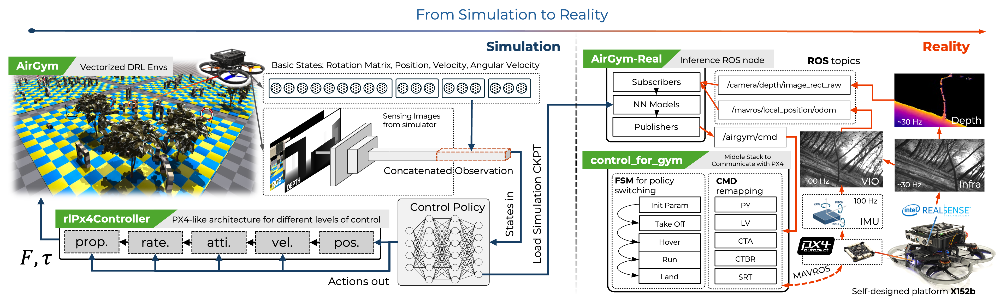
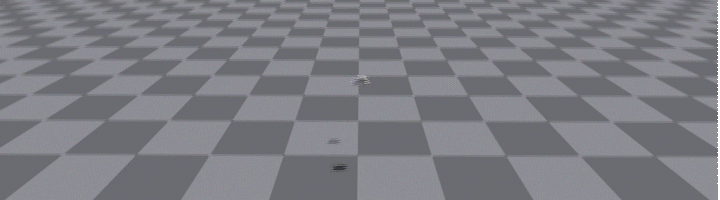

  
  
  
<div align="center">
  
  <p style="font-size: 1.2em; margin-top: -10px;">
    <i>A High-Performance Quadrotor Deep Reinforcement Learning Platform</i> <br>
    <b>Built on <span style="color: #76b900;">NVIDIA IsaacGym</span></b>
  </p>
</div>


<details>
<summary style="display: list-item; cursor: pointer; text-decoration: none">
  <h2 style="display: inline; border-bottom: none">Table of Contents</h2>
</summary>

1. [AirGym](#airgym)
2. [Features](#features)
3. [Environments](#environments)
- [Hovering](#hovering)
- [Tracking](#tracking)
- [Balloon (Target Reaching)](#balloon)
- [Avoid (Dynamic Obstacle)](#avoid)
- [Planning](#planning)
- [Customized Env](#customized-environments)
4. [Installation](#installation)
- [Requirements](#requirements)
- [One-shot Install](#one-shot-install)
- [Test the Installation](#test-the-installation)
5. [Usage](#uage)
- [Directory Structure Description](#directory-structure-parsing)
- [Training from Scratch](#training-from-scratch)
- [Playing and Testing](#playing-and-testing)
- [Customize a New Task](#customize-a-new-task)
6. [TODO](#todo)
7. [FAQ](#faq)
8. [License](#license)
9. [Acknowledgements](#acknowledgement)
10. [Citation](#citation)
</details>

## AirGym
AirGym is an open souce Python quadrotor simulator based on IsaacGym, a part of AirGym series Sim-to-Real workding flow. It provides a high-fidelity dynamics and Deep Reinforcement Learning (DRL) framework for quadrotor robot learning research. Furthermore, we also provide toolkits for transferring policy from AirGym simulator to the real quadrotor [emNavi-X152b](https://emnavi.tech/droneKit/#x152b%E5%B9%B3%E5%8F%B0), making Sim-to-Real possible. The documentation website is at https://emnavi.tech/AirGym/.

<p align="center">
  
</p>

The Sim-to-Real working flow of AirGym series is broken down into four parts:
- <span style="color: #76b900; ">[AirGym](https://github.com/emNavi/AirGym)</span>: the quadrotor simulation platform described in this repository, providing environments and basic training algorithm.
- <span style="color: #76b900; ">[rlPx4Controller](https://github.com/emNavi/rlPx4Controller)</span>: a flight geometric controller that maintains strict control logic alignment with the open-source PX4, for a better Sim-to-Real.
- <span style="color: #76b900; ">[AirGym-Real](https://github.com/emNavi/AirGym-Real)</span>: an onboard Sim-to-Real module compatible with AirGym, enabling direct loading of pretrained models, supporting onboard visual-inertial pose estimation, ROS topic publishing, and one-shot scripted deployment.
- <span style="color: #76b900; ">[control_for_gym](https://github.com/emNavi/control_for_gym)</span>:  a middleware layer based on MAVROS for forwarding control commands at various levels to PX4 autopilot. It includes a finite state machine to facilitate switching between DRL models and traditional control algorithms.

## Features
**AirGym is more lightweight and has a clearer file structure compared to other simulators**, because it was designed from the beginning with the goal of achieving Sim-to-Real transfer.</p>

- **Lightweight & Customizable**: AirGym is extremely lightweight yet highly extensible, allowing you to quickly set up your own customized training task.
- **Strict Alignment with PX4 Logic**: Flight control in AirGym is supported by [rlPx4Controller](https://github.com/emNavi/rlPx4Controller). It maintains strict control logic alignment with the open-source PX4, for a better Sim-to-Real.
- **Multiple Control Modes**: AirGym provides various control modes including PY (position & yaw), LV (linear velocity & yaw), CTA (collective thrust & attitude angle), CTBR (collective thrust & body rate), SRT (single-rotor thrust).
- **Sim-to-Real Toolkits**: AirGym series have complete flow of robot learning Sim-to-Real and provide a potential to transfer well-trained policies to a physical device.


## Environments
AirGym provides four basic tasks <font face='courier new'>Hovering</font>, <font face='courier new'>Balloon</font>, <font face='courier new'>Tracking</font>, <font face='courier new'>Avoid</font>, and a higher level task <font face='courier new'>Planning</font>. All tasks are implemented on [X152b](https://emnavi.tech/droneKit/#x152b%E5%B9%B3%E5%8F%B0) quadrotor frame since this is our Sim-to-Real device.

### <font face='courier new'>Hovering</font>
Task <font face='courier new'>Hovering</font>: the quadrotor is expected to be initialized randomly inside a cube with a side length of 2 meters, then converge into the center and hover until the end of the episode. Also, this task can be used as "go to waypoint" task if specify a target waypoint.

<p align="center">
  
</p>

### <font face='courier new'>Balloon</font>
Task <font face='courier new'>Balloon</font>: also called target reaching. It is essentially a variation of the
hovering task, but with a key difference: the quadrotor moves
at a higher speed, rapidly dashing toward the balloon (the target).

<p align="center">
  
</p>

### <font face='courier new'>Tracking</font>
Task <font face='courier new'>Tracking</font>: tracking a sequance of waypoints which is played as a trajectory. The tracking speed is effected by the trajectory playing speed.

<p align="center">
  
</p>

### <font face='courier new'>Avoid</font>
Task <font face='courier new'>Avoid</font>: hover and try to avoid a cube or a ball with random throwing velocity and angle. This task provides depth image as input.

<p align="center">
  
</p>

### <font face='courier new'>Planning</font>
Task <font face='courier new'>Planning</font>: a drone navigates and flies through a random generated woods like area, using only depth information as input. No global information is utilized in this task which means a better adaptation in a GNSS-deny environment and without a VIO.

<p align="center">
  
</p>

### Customized Environments
Furthermore, you can build a customized environment and even task upon AirGym. Here is a simple demo of random assets generation.

<p align="center">
  
</p>


## Installation
### Requirements
1. Ubuntu 20.04
1. [Conda](https://www.anaconda.com/download) or [Miniconda ](https://docs.conda.io/en/latest/miniconda.html)
> Note: this repository has been tested on Ubuntu 20.04 PyTorch 2.0.0 + CUDA11.8 with RTX4090.

### One-shot Install
Run `configuration.sh` to download and install [NVIDIA Isaac Gym Preview 4](https://developer.nvidia.com/isaac-gym-preview-4) and [rlPx4Controller](https://github.com/emNavi/rlPx4Controller) at `~`, and create a new conda environment named `airgym`. Note that `sudo` is required to install `apt` package:
```bash
chmod +x configuration.sh
./configuration.sh
```

### Test the Installation
You can run the example script which is a quadrotor position control illustration of 4096 parallel environments:
```bash
conda activate airgym
python airgym/scripts/example.py --task X152b --ctl_mode pos --num_envs 4
```
The default `ctl_mode` is position control.

## Usage
### Directory Structure Parsing
```bash
AirGym/
│
├── airgym/                                      # source code
│   ├── envs/                                    # envs definition
│   │    ├── base/                               # base envs
│   │    └── task/                               # tasks
│   │          ├── X152b_planning.py             # task env file
│   │          ├── X152b_planning_config.py      # task env config file
│   │          ├── ...
│   │           ...
│   │
│   ├── lib/                                     # RL algorithm
│   ├── scripts/                                 # debug scripts
│   └── utils/                                   # others
│
├── doc/                                         # doc assets
│
├── resources/                                   # assets
│   ├── env_assets/                              # env assets
│   └── robots/                                  # robot assets
│
├── scripts/                                     # program scipts
│   ├── config/                                  # config file for training
│   ├── runner.py                                # program entry
│   └── ...                                      
│
└── README.md                                    # introduction
```

### Training from Scratch
We train the model by a `rl_games` liked customed PPO (`rl_games` was discarded after the version 0.0.1beta because of its complexity for use). The training algorithm is at `airgym/lib` modified from `rl_games-1.6.1`. Of course you can use any other RL libs for training.

Training from scratch can be down within minites. Using <font face='courier new'>Hovering</font> as an example:
```bash
python scripts/runner.py --ctl_mode rate --headless --task X152b
```
Algorithm related parameters can be edited in `.yaml` files. Environment and simulator related parameters are located in ENV_config files like `X152bPx4_config.py`. The `ctl_mode` must be spicified.

The input arguments can be overrided:
| args | explanation |
|----------|----------|
| --play | Play(test) a trained network. |
| --task | Spicify a task.  'X152b', 'X152b_avoid', 'X152b_balloon', 'X152b_planning', 'X152b_tracking'|
| --num_envs | Spicify the number of parallel running environments.|
| --headless | Run in headless mode or not. |
| --ctl_mode | Spicify a control level mode from 'pos', 'vel', 'atti', 'rate', 'prop'. |
| --checkpoint | Load a trained checkpoint model from path. |
| --file | Spicify an algorithm config file for training. |

### Playing and Testing
Load a trained checkpoint is quite easy:
```bash
python scripts/runner.py --play --num_envs 64 --ctl_mode rate --checkpoint <path-to-ckpt>
```

> Important: ***emNavi*** provide a general quadrotor sim2real approach, please refer to **AirGym-Real** @https://github.com/emNavi/AirGym-Real.

### Customize a New Task
1. Create a new `.py` file in directory `airgym/envs/task`. Usually, we use `<task_name>.py` to describe an environment and a `<task_name>_config.py` to describe basic environment settings. You can follow this rule.
1. Register new task in `airgym/envs/task/__init__.py` and `airgym/lib/utils/vecenv.py`. The former is registration for AirGym environment, and the latter is registration for vectorized parallel environments required by algorithm. Using task <font face='courier new'>Planning</font> as an example:
```python
try:
    from .task.X152b_planning_config import X152bPlanningConfig
    from .task.X152b_planning import X152bPlanning
    task_registry.register("X152b_planning", X152bPlanning, X152bPlanningConfig())
except ImportError:
    print("WARNING! X152bPlanning or X152bPlanningConfig cannot be imported. Ignore if using on real robot inference.")
    traceback.print_exc()
```
```python
env_configurations.register('X152b_planning', {'env_creator': lambda **kwargs : task_registry.make_env('X152b_planning',args=Namespace(**kwargs)),
        'vecenv_type': 'AirGym-RLGPU'})
```

## TODO
TBC

## FAQ
TBC

## License
[LICENSE FILE](/LICENSE) 
This project is inspired and greatly improved from project aerial_gym_simulator that adheres to the BSD 3-Clause License. In consequence, this work will continuously develope under BSD 3-Clause License. Currently, we still use assets management part from aerial_gym_simulator although we have made a great changes, but we are rewriting and optimizing this part. In the future, we will continue to build upon BSD 3-Clause and claim the contributions of those who came before us.

## Acknowledgement
We thanks colleagues @emNavi Tech (https://emnavi.tech/) who develope and maintain the outstanding hardware device [emNavi-X152b](https://emnavi.tech/droneKit/#x152b%E5%B9%B3%E5%8F%B0) for Sim-to-Real task.

Also, we thanks the excellent work by Aerial Gym Simulator licensed(https://github.com/ntnu-arl/aerial_gym_simulator) under the BSD 3-Clause License. AirGym is modified and greatly improved upon Aerial Gym Simulator especially for Sim-to-Real task.

## Citation
TBC