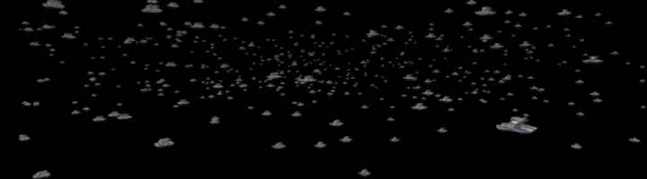
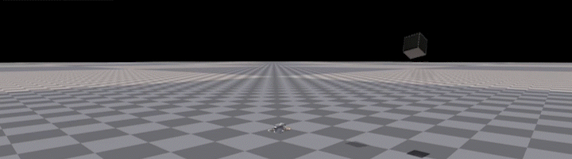

  
  
  
<div align="center">
  
  <p style="font-size: 1.2em; margin-top: -10px;">
    <i>A High-Performance Quadrotor Deep Reinforcement Learning Platform</i> <br>
    <b>Built on <span style="color: #76b900;">NVIDIA IsaacGym</span></b>
  </p>
</div>


<details>
<summary style="display: list-item; cursor: pointer; text-decoration: none">
  <h2 style="display: inline; border-bottom: none">Table of Contents</h2>
</summary>

1. [AirGym](#airgym)
2. [Features](#features)
3. [Environments](#environments)
- [Hovering](#hovering)
- [Tracking](#tracking)
- [Balloon (Target Reaching)](#balloon)
- [Avoid (Dynamic Obstacle)](#avoid)
- [Planning](#planning)
4. [Installation](#configuration)
5. [Usage](#contributing)
6. [TODO](#contributing)
7. [FAQ](#contributing)
8. [License](#license)
9. [Acknowledgements](#contributing)
10. [Citation](#contributing)
</details>

## AirGym
AirGym is an open souce Python quadrotor simulator based on IsaacGym, a part of AirGym series Sim-to-Real workding flow. It provides a high-fidelity dynamics and Deep Reinforcement Learning (DRL) framework for quadrotor robot learning research. Furthermore, we also provide toolkits for transferring policy from AirGym simulator to the real quadrotor [emNavi-X152b](https://emnavi.tech/droneKit/#x152b%E5%B9%B3%E5%8F%B0), making Sim-to-Real possible. The documentation website is at https://emnavi.tech/AirGym/.

<p align="center">
  
</p>

The Sim-to-Real working flow of AirGym series is broken down into four parts:
- <span style="color: #76b900; ">[AirGym](https://github.com/emNavi/AirGym)</span>: the quadrotor simulation platform described in this repository, providing environments and basic training algorithm.
- <span style="color: #76b900; ">[rlPx4Controller](https://github.com/emNavi/rlPx4Controller)</span>: a flight geometric controller that maintains strict control logic alignment with the open-source PX4, for a better Sim-to-Real.
- <span style="color: #76b900; ">[AirGym-Real](https://github.com/emNavi/AirGym-Real)</span>: an onboard Sim-to-Real module compatible with AirGym, enabling direct loading of pretrained models, supporting onboard visual-inertial pose estimation, ROS topic publishing, and one-shot scripted deployment.
- <span style="color: #76b900; ">[control_for_gym](https://github.com/emNavi/control_for_gym)</span>:  a middleware layer based on MAVROS for forwarding control commands at various levels to PX4 autopilot. It includes a finite state machine to facilitate switching between DRL models and traditional control algorithms.

> We thanks the excellent work by Aerial Gym Simulator licensed(https://github.com/ntnu-arl/aerial_gym_simulator) under the BSD 3-Clause License. AirGym is modified and greatly improved from Aerial Gym Simulator especially for Sim-to-Real task.

## Features
<p><span style="color: #76b900; ">AirGym is more lightweight and has a clearer file structure compared to other simulators</span>, because it was designed from the beginning with the goal of achieving Sim-to-Real transfer.</p>

- <span style="color: #76b900; ">Lightweight & Customizable</span>:AirGym is extremely lightweight yet highly extensible, allowing you to quickly set up your own customized training task.
- <span style="color: #76b900; ">Strict Alignment with PX4 Logic</span>: Flight control in AirGym is supported by [rlPx4Controller](https://github.com/emNavi/rlPx4Controller). It maintains strict control logic alignment with the open-source PX4, for a better Sim-to-Real.
- <span style="color: #76b900; ">Multiple Control Modes</span>: AirGym provides various control modes including PY (position & yaw), LV (linear velocity & yaw), CTA (collective thrust & attitude angle), CTBR (collective thrust & body rate), SRT (single-rotor thrust)
- <span style="color: #76b900; ">Sim-to-Real Toolkits</span>: AirGym series have complete flow of robot learning Sim-to-Real and provide a potential to transfer well-trained policies to a physical device.


## Environments
AirGym provides four basic tasks <font face='courier new'>Hovering</font>, <font face='courier new'>Balloon</font>, <font face='courier new'>Tracking</font>, <font face='courier new'>Avoid</font>, and a higher level task <font face='courier new'>Planning</font>. All tasks are implemented on [X152b](https://emnavi.tech/droneKit/#x152b%E5%B9%B3%E5%8F%B0) quadrotor frame since this is our Sim-to-Real device.

### <font face='courier new'>Hovering</font>
Task <font face='courier new'>Hovering</font>: the quadrotor is expected to be initialized randomly inside a cube with a side length of 2 meters, then converge into the center and hover until the end of the episode. Also, this task can be used as "go to waypoint" task if specify a target waypoint.


### <font face='courier new'>Balloon</font>
Task <font face='courier new'>Balloon</font>: also called target reaching. It is essentially a variation of the
hovering task, but with a key difference: the quadrotor moves
at a higher speed, rapidly dashing toward the balloon (the target).


### <font face='courier new'>Tracking</font>
Task <font face='courier new'>Tracking</font>: tracking a sequance of waypoints which is played as a trajectory. The tracking speed is effected by the trajectory playing speed.


### <font face='courier new'>Avoid</font>
Task <font face='courier new'>Avoid</font>: hover and try to avoid a cube or a ball with random throwing velocity and angle. This task provides depth image as input.


### <font face='courier new'>Planning</font>
Task <font face='courier new'>Planning</font>: a drone navigates and flies through a random generated woods like area, using only depth information as input. No global information is utilized in this task which means a better adaptation in a GNSS-deny environment and without a VIO.


### Customized Environments
Furthermore, you can build a customized environment and even task upon AirGym. Here is a simple demo of random assets generation.


## Installation
### Requirements
1. Ubuntu 20.04 or 22.04
1. [Conda](https://www.anaconda.com/download) or [Miniconda ](https://docs.conda.io/en/latest/miniconda.html)
1. [NVIDIA Isaac Gym Preview 4](https://developer.nvidia.com/isaac-gym) ([Pytorch]((https://pytorch.org/)) needs to upgrade for 40 series of GPUs. Please follow the installation guidance.)

> Note: this repository has been tested on Ubuntu 20.04/22.04 with PyTorch 2.0.0 + CUDA11.8.

### 1. Install IsaacGym Preview 4 with torch2.0.0+cuda11.8
1. Download package from the [official page](https://developer.nvidia.com/isaac-gym) and unzip.
1. Edit `install_requires` in `python/setup.py`:
    ```
    install_requires=[
                "numpy",
                "scipy",
                "pyyaml",
                "pillow",
                "imageio",
                "ninja",
            ],
    ```
1. Edit `dependencies` in `python/rlgpu_conda_env.yml`:
    ```python
    dependencies:
    - python=3.8
    - numpy=1.20
    - pyyaml
    - scipy
    - tensorboard
    ```
1. Create a new conda environment named `rlgpu` and install `isaacgym`:
    ```bash
    cd isaacgym
    ./create_conda_env_rlgpu.sh
    ```
1. Install PyTorch2.0.0 and CUDA11.8:
    ```bash
    conda activate rlgpu
    conda install pytorch==2.0.0 torchvision==0.15.0 torchaudio==2.0.0 pytorch-cuda=11.8 -c pytorch -c nvidia
    ```

### 2. Install [rlPx4Controller](https://github.com/FP-Flight/rlPx4Controller)
1. Install Eigen (The recommend version is 3.3.7):
    ```bash
    sudo apt install libeigen3-dev
    ```
1. Install pybind11:
    ```bash
    pip install pybind11
    ```
1. Install rlPx4Controller
    ```bash
    git clone git@github.com:emNavi/rlPx4Controller.git
    cd rlPx4Controller
    pip install -e .
    ```
### 3. Install AirGym
```bash
git clone git@github.com:emNavi/AirGym.git
cd AirGym/
pip install -e .
```
### 4. Test the installation
Run the example script:
```bash
cd airgym/scripts
python example.py --task X152b --ctl_mode pos
```
The default `ctl_mode` is position control.

## Training and Displaying
We train the model by a rl_games-liked customed PPO (rl_games was discarded after the version 0.0.1beta because of its complexity for use). Of course you can use any other RL libs for training. 

> Important: ***emNavi*** provide a general quadrotor sim2real approach, please refer to **AirGym-Real** @https://github.com/emNavi/AirGym-Real.

Training:
```bash
cd scripts
python runner.py --ctl_mode rate --headless --task X152b
```
Algorithm related parameters can be edited in `.yaml` files. Environment and simulator related parameters are located in ENV_config files like `X152bPx4_config.py`. The `ctl_mode` must be spicified.

Displaying:
```bash
cd airgym/rl_games/
python runner.py --play --num_envs 64 --ctl_mode rate --checkpoint <path-to-ckpt>
```

## Training a Trajectory Tracking Policy
Every task is mainly affected by two `.py` files. Use task X152b_sigmoid as an example. Env definition file is `X152b_tracking.py`, and the config file is `X152b_tracking_config.py`, which could change environmental configuration like control mode, adding assets, simulation specification. `ctl_mode` has five options: 'pos', 'vel', 'atti', 'rate', 'prop', and 'pos' is the default setting.

Algorithm related configuration can be edited in `ppo_X152b_tracking.yaml`. Environment related configuration can be edited in  `.../envs/.../X152b_tracking_config.py`.

Training:
```bash
cd airgym/rl_games/
python runner.py --task X152b_tracking--headless --ctl_mode rate  --file ppo_X152b_tracking.yaml
```

Displaying:
```bash
cd airgym/rl_games/
python runner.py --play --num_envs 4 --task X152b_tracking --ctl_mode rate --checkpoint <path-to-model>
```

## Task Descriptions

### Hovering

### Balloon

### Tracking

### Avoid

### Planning